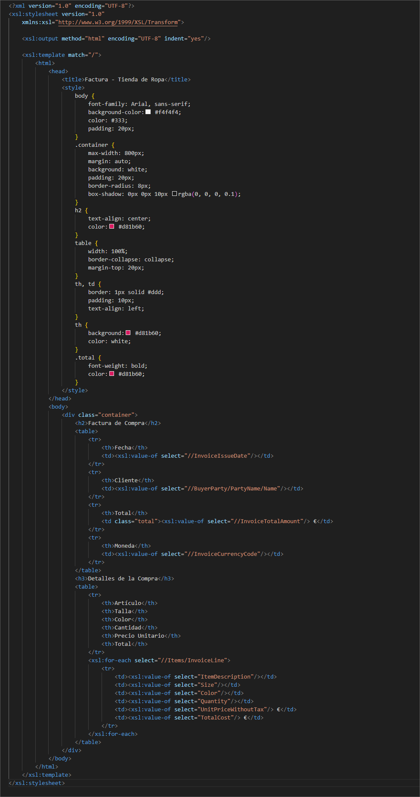
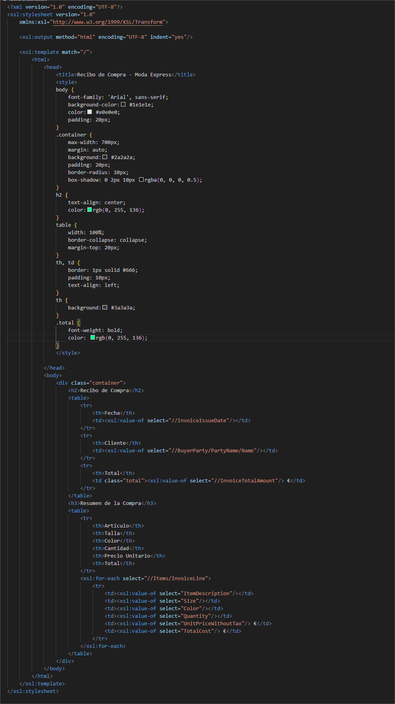

# Plantillas XSLT para Factura electrónica

Este repositorio contiene dos plantillas XSLT diseñadas para transformar archivos XML de facturas en formato FacturaE a documentos HTML fácilmente legibles.

## Archivos

- **facturaXSLT1.xslt**: Plantilla con un diseño oscuro y moderno.
- **facturaXSLT2.xslt**: Plantilla con un diseño claro y más tradicional.
- **factura.xml**: Archivo de ejemplo con datos de una factura.
- **factura1.html**: Resultado de aplicar `facturaXSLT1.xslt` a `factura.xml`.
- **factura2.html**: Resultado de aplicar `facturaXSLT2.xslt` a `factura.xml`.

## Descripción de las plantillas XSLT

### facturaXSLT1.xslt



- Utiliza una combinación de colores oscuros con fondo negro y detalles en rosa.
- Emplea la fuente "Arial" para un estilo más moderno.
- Organiza la información en una tabla con bordes y encabezados resaltados.
- Incluye clases CSS para mejorar la legibilidad y resaltar valores importantes.

### facturaXSLT2.xslt



- Presenta un diseño claro con colores neutros y una fuente más convencional.
- Usa un estilo más formal, con una tabla con bordes y un fondo blanco.
- Estructura la información de manera ordenada con secciones diferenciadas.

## Cómo usar las plantillas

1. Asegúrate de tener un procesador XSLT compatible, como un navegador moderno o herramientas como `xsltproc`.
2. Abre el archivo `factura.xml` en un editor de texto y enlaza la plantilla deseada con:
   ```xml
   <?xml-stylesheet type="text/xsl" href="xslt/facturaXSLT1.xslt"?>

   o
   
   <?xml-stylesheet type="text/xsl" href="xslt/facturaXSLT2.xslt"?>
